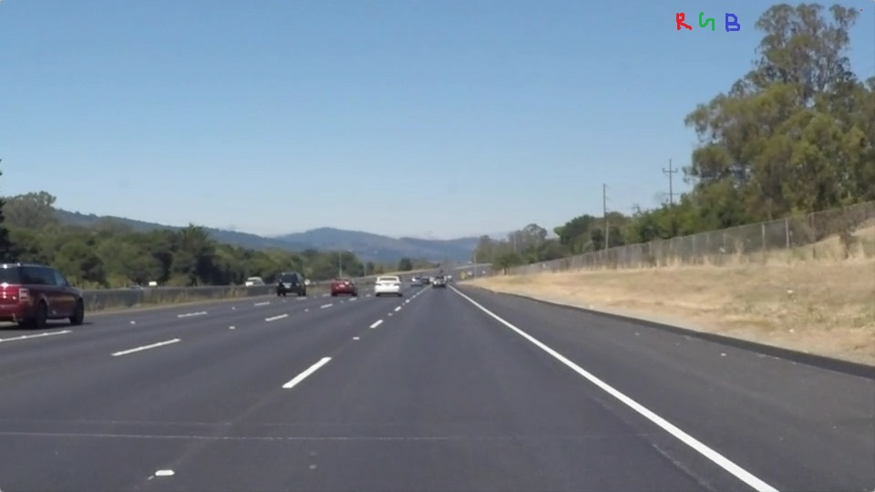
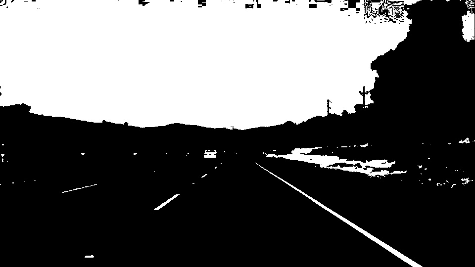
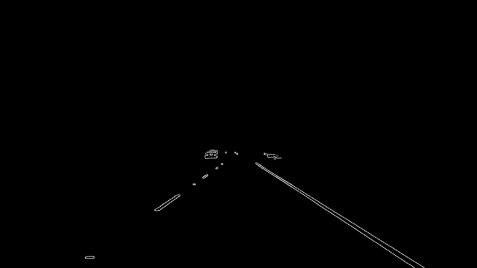
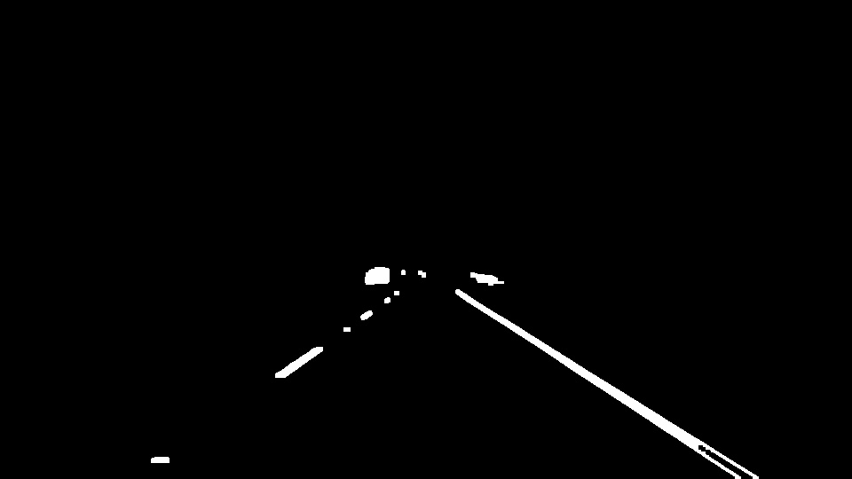
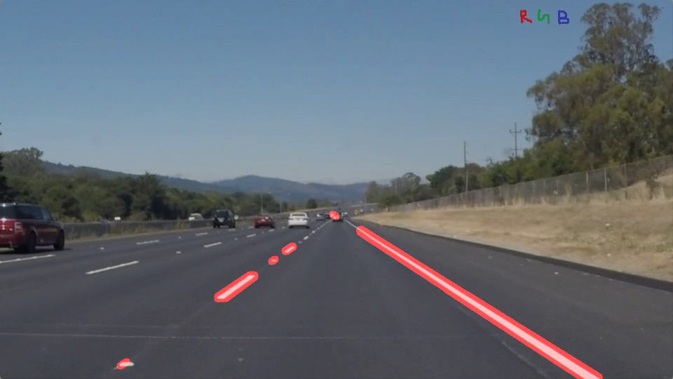
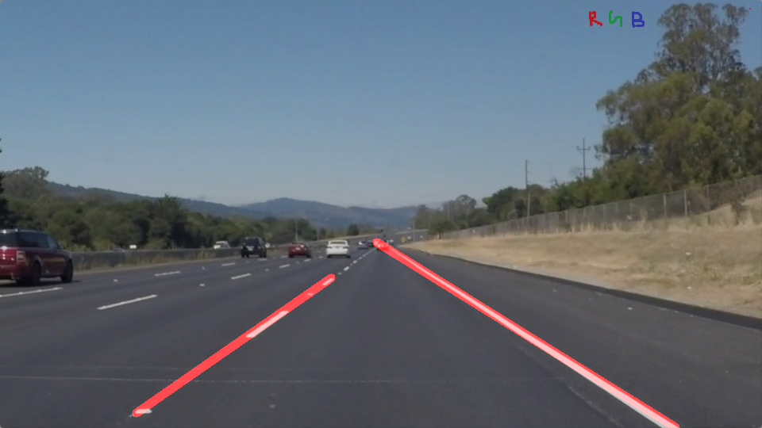

# **Finding Lane Lines on the Road** 

## Writeup Template

### You can use this file as a template for your writeup if you want to submit it as a markdown file. But feel free to use some other method and submit a pdf if you prefer.

---

**Finding Lane Lines on the Road**

The goals / steps of this project are the following:
* Make a pipeline that finds lane lines on the road
* Apply the pipeline to the video of traffic and check the performance

### Reflection

### 1. Describe your pipeline. As part of the description, explain how you modified the draw_lines() function.

My pipeline consisted of 5 steps. First, I converted the images to grayscale, then I .... 

In order to draw a single line on the left and right lanes, I modified the draw_lines() function by ...

* First, I converted the images to HSV image type.  From colorspaces exploration, _value_ component in HSV representation of image contained critical information of lines.
* Appropriate threshold is selected to filterout white/yellow parts of image. 
* But applying hard threshold results in artefacts around thresholded part. So a Gaussian Blur is applied to the resultant image before edge detection
* Next, Canny edge operator is applied on thresholded image 
* Mask is applied to edges image to filterout content containing the roads of the image
* Dilate and Erode edges image to fill double edges around lanes
* Detect lines from the resultant image
* Connect lines based on slopes of detected lines in the image

In order to draw a single line on the left and right lanes, I added a new function connect_lines():

Ability to join lines is achieved by following steps:
* Group lines by negative and positive slopes
* Select largest line in positive/negative sloped lines
* For each other line in the group compute point-line distance to the largest line
    * If point lies within a threshold, connect to the line

<figure> <figcaption>Source Image</figcaption></figure>
<figure>  <figcaption>Value component of HSV Image</figcaption></figure>
<figure>  <figcaption>Masked Edges</figcaption></figure>
<figure>  <figcaption>Postprocessed Edges</figcaption></figure>
<figure>  <figcaption>Lines edges</figcaption></figure>
<figure>  <figcaption>Final Lines edges</figcaption></figure>

### 2. Potential shortcomings with current pipeline
 Lane type of elements in the scene which fall in connect_lines() threshold

### 3. Possible improvements to your pipeline

A possible improvement would be to remove shadows in the images and discard artefacts due to line kind of elements on the road 
